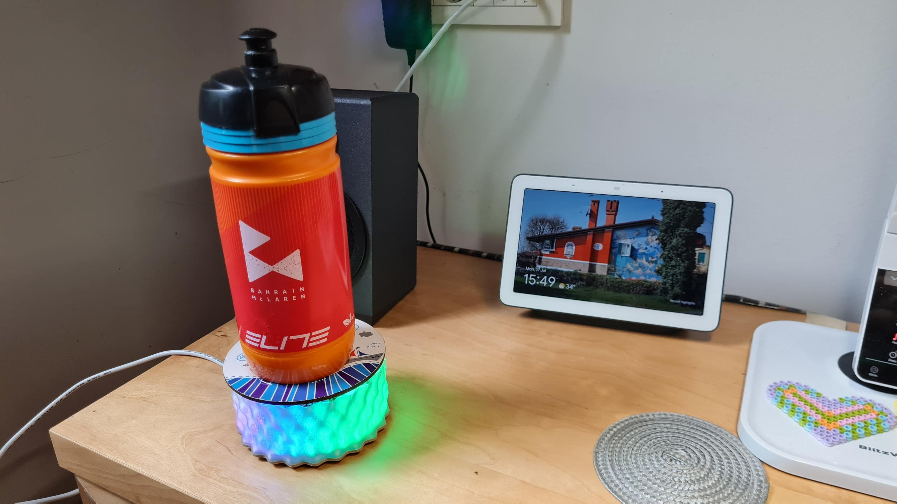
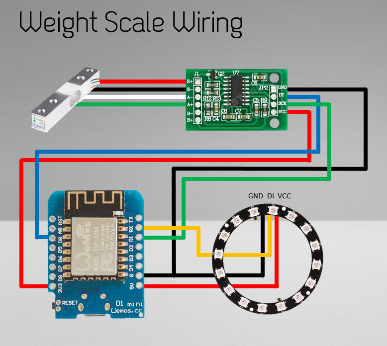

# Water Intake Monitor and Enforcement System

This is a ESP8266, ESPHome, Node-Red project to monitor how much water I drink throughout the day when I work from home and notify me to drink from time to time.
It is using an ESP Wemos D1 mini as a processor, load cell (strain gauge) to measure the weight of the water bottle, neopixel ring light for visual notification. The ESP runs an ESPHome sketch, communication is done over MQTT and the logic is implemented in Node-Red.

The logic does the following:
- Detects that a bottle is placed on the weight and stores the weight.
- Detects if the weight is reducing, assuming that water is consumed. This consumption is recorded and accumulated.
- When the weight increases, the logic assumes the bottle has been re-filled.
- If the weight is not changing, notification is sent and further reminder notification if there is no change.
- Ring light is used for visual notification, and the Node-Red code also includes example for Telegram message.
- If a goal is reached, no more notification is sent.
- If the weight is empty (bottle removed), no notification is sent at all.
- All logic is implemented in Node-Red, ESP just sends readings and receives messages to turn the light on/off.
- Main parameters of the code is configurable in Node-Red.

There is a detailed video on this project where all the details are explained:

ADD LINK

## Hardware

The hardware is an ESP8266 microcontroller running ESPHome firmware. You need the following hardware for this project:
- ESP6288 Wemos D1 Mini: I don't have a recent Aliexpress link, you can find these everywhere.
- 1kg Load cell with HX711 amplifier board: https://www.aliexpress.com/item/33046037411.html
- 24 pixel WS2812 ring light: https://www.aliexpress.com/item/32963152993.html

The wiring diagram is here:

In order for the load cell to work, one side of the load cell needs to be supported from the "underside". The weight must be applied on the other end from the "top". Make sure the actual load cell elements (under the white glue) are free and not weight is applied to them.

## ESPHome

You can find my ESPHome yaml file in the repo: [weight.yaml](weight.yaml) and also the [secrets.yaml](secrets.yaml) in which the IDs and password are stored separately.
Obviously update your credential details in the `secrets.yaml` file and there is where all the settings are stored. But the load cell needs to be calibrated in the main `weight.yaml` file. This process is again explained in the video.

## Case

I have designed a 3D printed case for this project. Is consists of a base [WaterScale_Stand.stl](WaterScale_Stand.stl) and a separate side [WaterScale_Wavy side.stl](WaterScale_Wavy side.stl) which is printed from a transparent filament. I designed both parts to be printed without support. I also used some felt feets so the scale does not slide around the table.
The top of the scale is cut from 4mm acrylic. I also have the 2D drawings for that [weight_plate.dxf](weight_plate.dxf).I cut this on my CNC router, but you can use a jigsaw as well, and for the spacer just use stack of washers.

## Node-Red Flow

